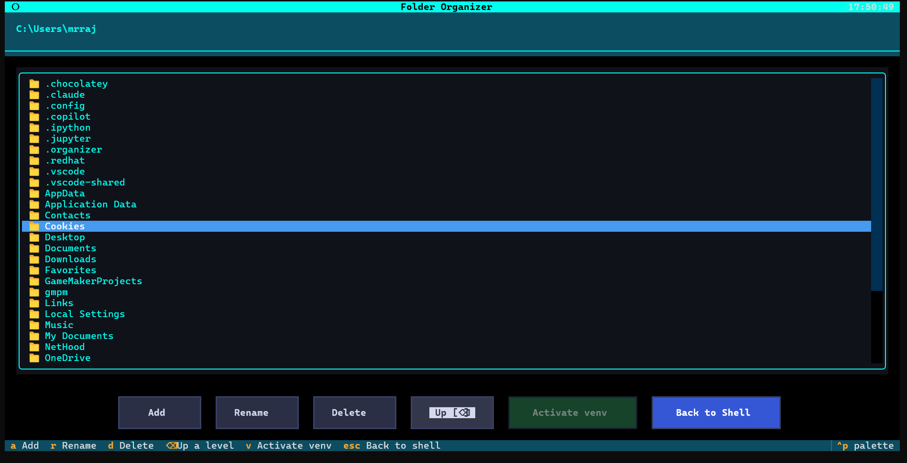
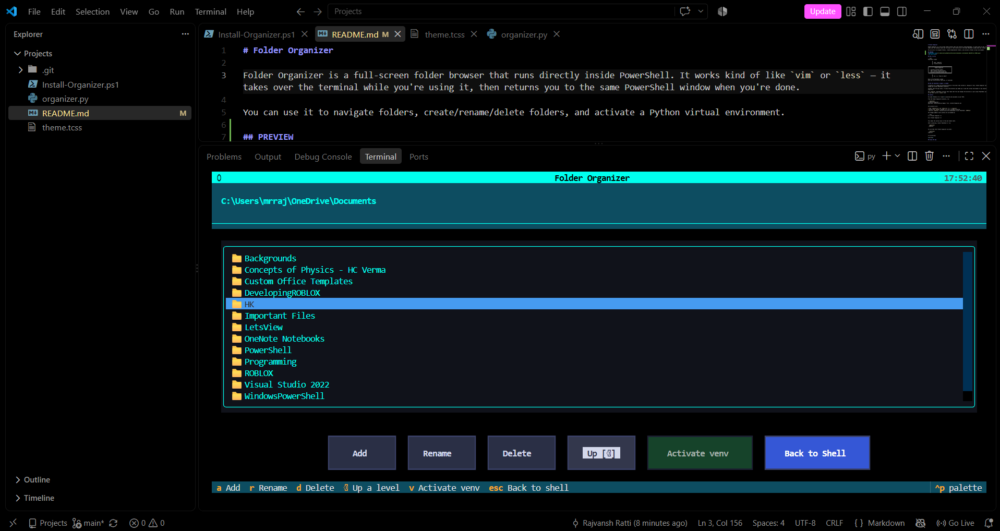

# Folder Organizer

Folder Organizer is a full-screen folder browser that runs directly inside PowerShell. It works kind of like `vim` or `less` — it takes over the terminal while you're using it, then returns you to the same PowerShell window when you're done.

You can use it to navigate folders, create/rename/delete folders, and activate a Python virtual environment.

## Preview



## How it works

```text
PowerShell prompt

        │
        │  type `organizer`
        │  or press Ctrl+O
        ▼

┌────────────────────────────────────────────┐
│            Folder Organizer                │
│                                            │
│  - navigate through folders                │
│  - add / rename / delete folders           │
│  - activate a detected Python venv         │
└────────────────────────────────────────────┘

        │
        │  Esc / q / "Back to Shell"
        ▼

Back at the PowerShell prompt
with your new directory (and venv, if selected)
```

## Why the PowerShell wrapper is needed

A program can't change the working directory of the shell that started it. Because of this, Folder Organizer can't simply run `cd` and change your actual PowerShell directory.

Instead, when the app closes, it saves the directory you ended up in (and the virtual environment if you selected one) to a small state file.

The `organizer` PowerShell function then reads that file and changes the directory in your actual PowerShell session. This is similar to how tools such as `zoxide` work.

## Install

You need **Python 3.9 or newer** installed and available on your PATH.

From the Folder Organizer directory, run:

```powershell
cd path\to\organizer
powershell -ExecutionPolicy Bypass -File .\Install-Organizer.ps1
```

The installer will:

* Copy `organizer.py` and `theme.tcss` to `~/.organizer`
* Install the `textual` package if it isn't already installed
* Add the `organizer` function and Ctrl+O keybinding to your PowerShell `$PROFILE`

The changes added to your profile are surrounded by:

```text
# >>> Folder Organizer >>>
...
# <<< Folder Organizer <<<
```

This makes the section easy to find and remove later.

After installing, restart PowerShell or run:

```powershell
. $PROFILE
```

You can then start Folder Organizer by either:

```powershell
organizer
```

or by pressing:

**Ctrl+O**

## Using the app

| Action          | How                                           |
| --------------- | --------------------------------------------- |
| Enter a folder  | Click it, or highlight it and press Enter     |
| Go up a folder  | Backspace or the **Up** button                |
| Add a folder    | Press `a` or click **Add**                    |
| Rename a folder | Press `r` or click **Rename**                 |
| Delete a folder | Press `d` or click **Delete**                 |
| Activate a venv | Press `v` or click **Activate venv**          |
| Exit            | Press `Esc` / `q`, or click **Back to Shell** |

### Virtual environments

If the current directory contains a folder named:

```text
venv
.venv
env
```

the **Activate venv** option will be enabled.

Selecting it exits Folder Organizer and activates that environment in your PowerShell session.

## Customizing the appearance

The appearance can be changed by editing:

```text
~/.organizer/theme.tcss
```

This is a Textual CSS file, so you can change things like colors, borders, spacing, and hover effects.

Some of the main selectors are:

* `Screen` — overall background
* `#breadcrumb` — current path
* `ListView` / `ListItem` — folder list
* `ListView > ListItem.--highlight` — selected folder
* `#toolbar Button` — toolbar buttons
* `Button.-primary` / `Button.-success` / `Button.-error` — different button styles

After saving the file, just restart `organizer`. You don't need to run the installer again.

## Uninstall

To uninstall Folder Organizer, remove the section between:

```text
# >>> Folder Organizer >>>
```

and:

```text
# <<< Folder Organizer <<<
```

from your PowerShell `$PROFILE`.

Then delete:

```text
~/.organizer
```

That's it.
